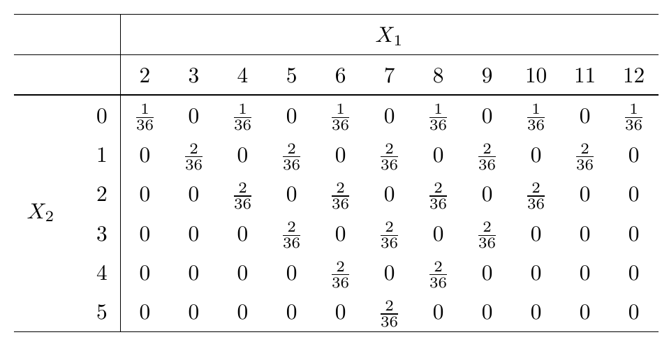

\newcommand\given[1][]{\:#1\vert\:}
\newcommand\P[1]{P{\left(#1\right)}}
\newcommand\F[1]{F_{\tiny{#1}}}
\newcommand\f[1]{f_{\tiny{#1}}}
\newcommand\p[1]{p_{\tiny{#1}}}

## from last time 

Theorem: $X \perp Y$ if and only if the joint cdf $F(x,y) = \F{X}(x)\F{Y}(y)$ is the product of the marginal cdfs.

Proof: $\Longleftarrow$ ("only if") too hard; $\Longrightarrow$ left as exercise.

Corollary: $X \perp Y$ if and only if the joint $f(x,y) = \f{X}(x)\f{Y}(y)$

To verify, in practice check two things:

1. The density factors. **Note: enough to factor into a function of $x$ and a function of $y.$**
2. The non-zero region is a rectangle (possibly infinite in either direction.) **Note: technically a "cross product" is all that is needed, but in almost all practical cases it will be a rectangle.**

## other important independence results (advanced) { .build }

Theorem: If $X$ and $Y$ are independent, so are $g(X)$ and $h(Y)$ for any* functions $g$ and $h$.

Sketch of proof: ...

Definition of independence extends to any number of random variables. We say $X_1, X_2,\ldots,X_n$ are independent if:
$$P(X_1 \in A_1, X_2 \in A_2, \ldots, X_n \in A_n) = P(X_1 \in A_1)\cdots P(X_n \in A_n)$$

for any* subsets $A_i \in \mathbb{R}$.

## conditional distributions

Recall the sum $X$ and the absolute difference $X$ of two dice:

## discrete case { .build }

Given a joint pmf for $X$ and $Y$ denoted by $p(x, y)$, define:
$$\p{X|Y}(x|y) = \begin{cases}
\frac{p(x,y)}{\p{Y}(y)} &: \text{ where } \p{Y}(y) > 0\\
0 &: \text{ otherwise }\end{cases}$$
For any fixed $Y$ with $\p{Y}(y) > 0$, this is a valid pmf.

This pmf describes what is called "the conditional distribution of $X$ given $Y = y.$"

Useful result:
$$\begin{align*}
p(x,y) &= \p{X|Y}(x|y)\p{Y}(x)\\
\p{X}(x) &= \sum\limits_{y} \p{X|Y}(x|y)\p{Y}(y)\end{align*}$$

## classic example { .build }

At home my phone rings $Y$ times with $Y\sim\text{Poisson}(\lambda)$ in one hour.I answer the phone with probability $p$ when it rings. What is the distribution of the $X$, the number of times I answer the phone in an hour?

(In fact $p$ so $X=0$ always. Note for people not in attendance...this is a joke about me not answering the phone.)

## continuous case { .build }

The concept is similar. We examine a "slice" of the joint density at, say $X=x$ and consider the distribution of $Y$ at that fixed value of $x$.

The *conditional density of $Y$ given $X=x$* is defined as:
$$\f{Y|X}(y|x) = \frac{f(x,y)}{\f{X}(x)}$$
wherever $\f{X}(x) > 0$. *Note: what is meant by this is $\f{X|Y}$ is only defined whenever $\f_X(x)=0.$ One still needs to carefully consider the support of $\f{Y|X}.$.

Examples:

1. $f(x, y) = \frac{1}{\pi}$ on $x^2 + y^2 \le 1$.
2. $f(x,y) = \lambda^2e^{-\lambda y}$ on $0 < x < y$.

# the bivariate normal distributions - an important class of joint distributions

## since civilization is over anyway... { .build }

Let's do something **crazy**. Recall $X \sim N(\mu, \sigma^2)$ has density for all $x\in\mathbb{R}$:
$$\f{X}(x) = \frac{1}{\sigma\sqrt{2\pi}}
\exp\left(-\frac{1}{2}\frac{(x-\mu)^2}{\sigma^2}\right)$$

Re-imagine $x$ and $\mu$ as a column vectors with one element each: $\mathbf{x} = \begin{pmatrix}x\end{pmatrix}$ and $\mathbf{\mu} = \begin{pmatrix}\mu\end{pmatrix}.$ Re-imagine $\sigma^2$ as a $1\times 1$ matrix $\mathbf\Sigma = \begin{pmatrix}\sigma^2\end{pmatrix}$. 

Note that $\det{\mathbf\Sigma} = |\mathbf\Sigma| = \sigma^2$ and $\mathbf\Sigma^{-1} = \frac{1}{\sigma^2},$ and:

$$\f{X}(x) = \frac{1}{|\mathbf\Sigma|^{1/2}(2\pi)^{1/2}}
\exp\left(-\frac{1}{2}(\mathbf{x}-\mathbf\mu)^t\mathbf\Sigma^{-1}(\mathbf{x}-\mathbf\mu)\right)$$

## bivariate normal

The random variables $X_1$ and $X_2$ have a bivariate normal distribution with paramaters $\mu_1$, $\mu_2$, $\sigma^2_1>0$, $\sigma^2_2>0$, and $-1<\rho<1$ if:

$$f(x_1, x_2) = \frac{1}{|\mathbf\Sigma|^{1/2}(2\pi)^{2/2}}
\exp\left(-\frac{1}{2}(\mathbf{x}-\mathbf\mu)^t\mathbf\Sigma^{-1}(\mathbf{x}-\mathbf\mu)\right)$$

where:

$$\mathbf{x} = \begin{pmatrix}x_1 \\ x_2\end{pmatrix}
\qquad
\mathbf{\mu} = \begin{pmatrix}\mu_1 \\ \mu_2\end{pmatrix}
\qquad
\mathbf\Sigma = \begin{pmatrix}\sigma_1^2 & \rho\sigma_1\sigma_2\\
\rho\sigma_1\sigma_2 & \sigma_2^2\end{pmatrix}$$

## book version of density 

Some work will reveal that this is equivalent to the formula given in the textbook.

These densities actually look like "bells".

What if $\rho = 0$?

The densities have the interesting properties that the *marginal distributions* are normal, and the *conditional distributions* are also normal. 